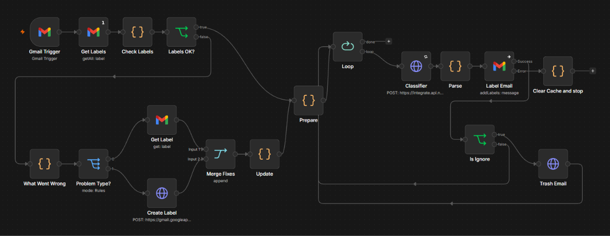
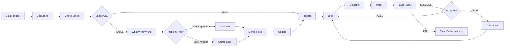

# Email Lable Automation

[](https://n8n.io)
[](https://developers.google.com/gmail/api)
[](https://build.nvidia.com)
[](LICENSE)

> An intelligent, production-ready n8n workflow that monitors Gmail, classifies incoming emails using NVIDIA's Nemotron AI, automatically applies color-coded labels, and routes junk/marketing mail to Trash with built-in self-healing label management.

---

## Workflow Diagram


*Full n8n canvas execution graph displaying the 5 core stages and color-coded sticky note sections.*

### Architectural Flowchart



---

## What It Does

1. **Monitors Incoming Mail**: Polls your Gmail inbox every minute for new messages, automatically bypassing Sent and Draft items.
2. **Self-Heals Label Cache**: Maintains a fast in-memory map of label names to Gmail IDs (`labelCache`) in n8n static data. If a label is deleted or modified in Gmail, the workflow automatically recreates it via the Gmail REST API with proper colors and refreshes the cache without human intervention.
3. **Buffers Email Bursts**: Processes emails sequentially one-by-one via batch looping, safely handling simultaneous spikes of 10–20+ emails.
4. **AI-Powered Classification**: Sends a truncated 1500-character snippet of each email to NVIDIA's `nvidia/nemotron-3-ultra-550b-a55b` model, classifying the intent into one of 5 distinct categories.
5. **Smart Routing & Safe Trash**: Applies the resolved Gmail label. Emails marked as **`🗑️ Ignore`** are immediately moved to Gmail Trash (recoverable for 30 days; never permanently deleted). If classification is ever unclear, it fails safely to **`⚡ Action`** to ensure important mail is never missed.

---

## Key Features

- **5-Tier Label Taxonomy**: Purpose-built classification covering Action, Work, Personal, Finance, and Ignore.
- **Self-Healing Static Data Cache**: Uses n8n's `$getWorkflowStaticData('global')` to avoid unnecessary Gmail API calls, self-repairing when labels change.
- **Burst-Safe Sequential Queue**: Employs `splitInBatches` (batch size 1) to prevent rate limits and ensure deterministic processing.
- **Fail-Safe Fallbacks**: Malformed or unparseable AI responses automatically default to `⚡ Action`.
- **Soft Trashing**: Ignore items are sent to Gmail's Trash container, preserving a 30-day recovery window.
- **Clean In-Canvas Sticky Notes**: Includes 7 color-coded n8n sticky notes organizing sections and setup instructions right on the workflow canvas.

---

## Label Taxonomy & Color Palette

The workflow uses colors that strictly adhere to Gmail's restricted API color palette:

| Label Name | Hex Code | Text Color | Intended Categories | Behavior |
|---|---|---|---|---|
| **⚡ Action** | `#cc3a21` | `#ffffff` | Urgent matters, required actions, legal, security alerts, OTP codes, authentication | Label only (High Priority) |
| **💼 Work** | `#285bac` | `#ffffff` | Professional correspondence, team updates, meeting invites | Label only |
| **👤 Personal** | `#16a766` | `#ffffff` | Personal chats, family, social platform notifications, travel | Label only |
| **💵 Finance** | `#fad165` | `#000000` | Invoices, banking, payment receipts, order shipping notifications | Label only |
| **🗑️ Ignore** | `#666666` | `#ffffff` | Newsletters, marketing, promotions, broadcast announcements, spam | Label + **Move to Trash** |

---

## How It Works Step-by-Step

### 1. Trigger & Cache Check
- **Gmail Trigger**: Polls Gmail every 60 seconds (`simple: false` to retain full message headers and snippet).
- **Get Labels**: Fetches all existing labels from Gmail once per execution (`executeOnce: true`).
- **Check Labels**: Inspects workflow static data (`labelCache`). If all 5 labels exist in cache and their IDs match the live Gmail list, it routes directly to **Prepare**.

### 2. Self-Healing Subgraph (When Cache/Labels Mismatch)
- **What Went Wrong**: Analyzes discrepancies and tags labels as either `ID_PROBLEM` (exists in Gmail with changed ID) or `MISSING` (absent).
- **Problem Type?**: Splits execution path based on the issue type.
- **Get Label**: Retrieves the updated ID from Gmail if the label exists.
- **Create Label**: Calls the Gmail REST API (`POST https://gmail.googleapis.com/gmail/v1/users/me/labels`) with approved hex color parameters.
- **Merge Fixes & Update**: Merges both branches and writes the resolved name ↔ ID pairs into `staticData.labelCache`.

### 3. Email Preparation & Sequential Loop
- **Prepare**: Extracts all messages from the trigger run, filters out any carrying `SENT` or `DRAFT` labels, strips HTML from the body, and trims a clean 1500-character snippet.
- **Loop**: Feeds one email at a time to the classifier (`splitInBatches`, size 1).

### 4. NVIDIA AI Classifier & Response Parser
- **Classifier**: Calls NVIDIA's API (`POST https://integrate.api.nvidia.com/v1/chat/completions`) using `nvidia/nemotron-3-ultra-550b-a55b` with `temperature: 0` and `stream: false`. Retries 3 times on transient connection errors.
- **Parse**: Strips any `<think>` reasoning tags, extracts the JSON category, maps it to the cached `labelId`, and safely assigns `⚡ Action` if the output is malformed.

### 5. Actions, Trashing & Failure Handling
- **Label Email**: Attaches the computed label to the message via the Gmail API.
- **Clear Cache and stop**: If labeling fails (e.g., label ID invalid), execution diverts to error output, deletes `labelCache` from static data, and throws a terminal error so the next poll heals the cache from scratch.
- **Is Ignore & Trash Email**: If the label is `🗑️ Ignore`, issues a message trash call (`POST https://gmail.googleapis.com/gmail/v1/users/me/messages/{messageId}/trash`). All other labels cycle back to the Loop immediately.

---

## Requirements

- **n8n**: Version 1.50.0 or later (self-hosted or n8n Cloud).
- **Google Cloud Console Account**: With Gmail API enabled and an OAuth2 Client ID/Secret.
- **NVIDIA Developer Account**: With access to the NVIDIA API Catalog and an API key.

---

## Quick Start

1. **Import the Workflow**:
   - In n8n, navigate to **Workflows > Import from File**.
   - Select [`workflow/Email-Lable-Automation.json`](workflow/Email-Lable-Automation.json).
2. **Configure Credentials**:
   - Follow the detailed [Credentials Setup Guide](docs/CREDENTIALS_SETUP.md) to create:
     - **Gmail OAuth2 API** credential (`https://www.googleapis.com/auth/gmail.modify`).
     - **Header Auth** credential (`Authorization: Bearer <YOUR_NVIDIA_API_KEY>`).
3. **Attach Credentials to Nodes**:
   - Attach your Gmail credential to: `Gmail Trigger`, `Get Labels`, `Get Label`, `Create Label`, `Label Email`, and `Trash Email`.
   - Attach your NVIDIA Header Auth credential to: `Classifier`.
4. **Verify Model ID**:
   - Double-check that `nvidia/nemotron-3-ultra-550b-a55b` is active on [build.nvidia.com](https://build.nvidia.com).
5. **Test Manually**:
   - Click **Test step** or **Test workflow** with an unread message in your inbox. Verify that missing labels are created and the email is categorized.
6. **Activate**:
   - Toggle the workflow switch to **Active** to start automatic 1-minute inbox processing.

---

## Configuration Reference

| Parameter | Location | Default Value | Notes |
|---|---|---|---|
| **Polling Interval** | `Gmail Trigger` | Every minute | Adjust under `pollTimes` if desired |
| **Model Slug** | `Classifier` | `nvidia/nemotron-3-ultra-550b-a55b` | Located in the JSON request body |
| **Snippet Length** | `Prepare` | 1500 characters | Modifiable via `slice(0, 1500)` in node code |
| **Label Config & Colors** | `Check Labels` | `CONFIG` array in Code | Modifies names, hex codes, and categories |
| **Retry on Classifier** | `Classifier` | 3 tries, 2000 ms wait | Configured in node settings |

---

## Credentials Reference Table

| Node Name | Credential Type | Permission / Header | Where to Obtain |
|---|---|---|---|
| **Gmail Trigger** | Gmail OAuth2 | `https://www.googleapis.com/auth/gmail.modify` | [Google Cloud Console](https://console.cloud.google.com/) |
| **Get Labels** | Gmail OAuth2 | `https://www.googleapis.com/auth/gmail.modify` | Google Cloud Console |
| **Get Label** | Gmail OAuth2 | `https://www.googleapis.com/auth/gmail.modify` | Google Cloud Console |
| **Create Label** | Gmail OAuth2 (Predefined) | `https://www.googleapis.com/auth/gmail.modify` | Google Cloud Console |
| **Classifier** | Header Auth | `Authorization: Bearer <NVIDIA_KEY>` | [NVIDIA API Catalog](https://build.nvidia.com/) |
| **Label Email** | Gmail OAuth2 | `https://www.googleapis.com/auth/gmail.modify` | Google Cloud Console |
| **Trash Email** | Gmail OAuth2 (Predefined) | `https://www.googleapis.com/auth/gmail.modify` | Google Cloud Console |

---

## Test Scenarios & Verification Matrix

The workflow has been tested against the following 10 validation scenarios (from PRD Section 13):

| Test ID | Scenario | Expected Outcome | Result |
|---|---|---|---|
| **T1** | Empty cache, no labels in Gmail | 5 labels created with colors, cache populated, emails processed | Passed |
| **T2** | Empty cache, labels already exist in Gmail | `Get Label` branch discovers existing IDs, zero duplicate labels created | Passed |
| **T3** | One label deleted in Gmail | Self-healing creates only the deleted label and updates cache | Passed |
| **T4** | One label missing + one ID changed | Both branches execute in parallel; `Merge Fixes` consolidates | Passed |
| **T5** | Healthy cache match | Bypasses healing graph entirely; routes directly to `Prepare` | Passed |
| **T6** | Burst of 12+ emails simultaneously | `Loop` processes items sequentially without rate limit exceptions | Passed |
| **T7** | Newsletter / Promotional email | Applied label `🗑️ Ignore` and moved to Trash | Passed |
| **T8** | Forced `Label Email` failure | Clears cache, marks run as failed; next run cleanly recovers | Passed |
| **T9** | AI returns malformed text / non-JSON | Safely falls back to `⚡ Action`, prevents trashing | Passed |
| **T10** | OTP / Security verification email | Correctly classified as `⚡ Action` | Passed |

---

## Known Issues and Nuances

- **Static Data in Manual Runs**: n8n Workflow Static Data (`labelCache`) persists across runs **only when the workflow is active** (triggered automatically). In manual executions in the editor, static data resets after the test.
- **Gmail Label Propagation & `Retry On Fail`**: When a label is created via API, Gmail's internal indices can occasionally take 1-2 seconds to make the new label available for message labeling. In the workflow, `Label Email` currently has `onError: "continueErrorOutput"` enabled (with `retryOnFail` unset). If a freshly created label is rejected on the very first second, the workflow routes to `Clear Cache and stop`, failing the run so that the next minute's poll picks it up cleanly. Users in high-latency environments may optionally enable **Retry On Fail** (2 retries, 2000 ms) directly on `Label Email`.
- **Gmail Color Palette Restrictions**: The Gmail API enforces a fixed set of approved hex codes. Changing the hex codes in `Check Labels` to unsupported colors will cause label creation to fail.

---

## Safety & Security

- **Safe Trashing**: Emails classified as `🗑️ Ignore` are moved to Gmail's native Trash container using Gmail API's `trash` endpoint. They remain recoverable for 30 days and are never permanently deleted by the workflow.
- **Fallback Protection**: Any unparseable AI output, JSON extraction error, or unknown category defaults to `⚡ Action`.
- **Zero Sensitive Data**: All credentials, personal email addresses, authorization headers, and instance IDs have been completely stripped from the exported JSON.

---

## Project Structure

```text
.
├── .github/
│   └── ISSUE_TEMPLATE/
│       ├── bug_report.yml
│       └── feature_request.yml
├── .env.example
├── .gitignore
├── CHANGELOG.md
├── CONTRIBUTING.md
├── LICENSE
├── README.md
├── SECURITY.md
├── docs/
│   ├── CREDENTIALS_SETUP.md
│   ├── PRD.md
│   └── TROUBLESHOOTING.md
├── images/
│   └── workflow-canvas.png
└── workflow/
    └── Email-Lable-Automation.json
```

---

## Links & Further Documentation

- [Step-by-Step Credentials Setup](docs/CREDENTIALS_SETUP.md)
- [Troubleshooting & Recovery](docs/TROUBLESHOOTING.md)
- [Product Requirements Document (PRD)](docs/PRD.md)
- [Contributing Guidelines](CONTRIBUTING.md)
- [Security Policy](SECURITY.md)

---

## Contributing & License

Contributions are welcome! Please review [CONTRIBUTING.md](CONTRIBUTING.md) before submitting pull requests.

This project is licensed under the [MIT License](LICENSE) © 2026 [aryankumar-04](https://github.com/aryankumar-04).
