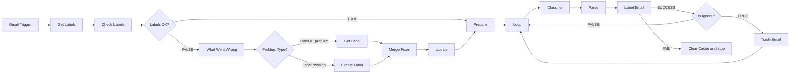

# PRD — n8n Workflow: "Email Lable Automation"

> Workflow name is kept **exactly** as requested: `Email Lable Automation` (spelling intentional).
> Node names use the correct spelling ("Label").

---

## 1. Overview

An n8n workflow that watches a Gmail account, classifies every new email with NVIDIA's `nvidia/nemotron-3-ultra-550b-a55b` model, applies one of five Gmail labels, and moves anything classified as **🗑️ Ignore** to Trash.

A cached **label name ↔ label ID** map (Workflow Static Data) avoids fetching label IDs on every run and self-heals when a label is missing or its ID changes.

## 2. Goals / Non-Goals

**Goals**
- Label every incoming email with exactly one of 5 labels.
- Handle bursts (10–15+ emails in one poll) by processing them one at a time in a loop.
- Self-heal label problems (missing label, changed/missing ID).
- Fail loudly (execution marked as failed) if labelling fails, and clear the cache so the next run rebuilds it.

**Non-Goals**
- Credentials / OAuth setup (handled by the owner).
- Replying to, forwarding, or archiving emails.
- Re-labelling old mail (only new mail from the trigger).

## 3. Confirmed Decisions

| Topic | Decision |
|---|---|
| Cache storage | n8n **Workflow Static Data** (`$getWorkflowStaticData('global')`) |
| Trigger scope | **Every new email**, polling **every minute** |
| Classifier call | **HTTP Request** node → NVIDIA API, exact model ID |
| Model | `nvidia/nemotron-3-ultra-550b-a55b` |
| Body snippet | First **1500 characters** of the email body |
| Auth | Owner handles all credentials / OAuth |

## 4. Label Taxonomy

| Label Name | Hex | RGB | Categories the AI may return | Behaviour |
|---|---|---|---|---|
| ⚡ Action | `#d93025` | 217, 48, 37 | Urgent, Action, Legal, Security, OTP, Auth | Label only |
| 💼 Work | `#1e53b8` | 30, 83, 184 | Work, Meeting | Label only |
| 👤 Personal | `#16a765` | 22, 167, 101 | Personal, Social, Travel | Label only |
| 💵 Finance | `#fbe983` | 251, 233, 131 | Finance, Receipts, Shipping | Label only |
| 🗑️ Ignore | `#757575` | 117, 117, 117 | Newsletters, Reading, Alerts, Promos, Spam | Label, then **move to Trash** |

**Gmail colour caveat:** the Gmail API only accepts colours from a fixed palette. Some of the hex values above may be rejected. Colours are applied **only when a label is created** (existing labels are not recoloured). If any hex is rejected/unsupported, the builder must **stop and ask the owner** which nearest palette colour to use.

## 5. Flow Diagram



## 6. Node Specification

Core nodes match your diagram. Four **helper nodes** (marked ➕) are needed because n8n's Code node has only one output, so branching needs an IF/Switch, and two branches joining `Update` need a Merge.

| # | Node | n8n node type | What it does | Receives from | Sends to |
|---|---|---|---|---|---|
| 1 | **Gmail Trigger** | `gmailTrigger` | Polls every minute, no filters, Simple = OFF (full message: id, subject, from, text/html, labelIds). Emits one item per new email. | — | Get Labels |
| 2 | **Get Labels** | `gmail` (Label → Get Many, return all) | Fetches all labels from Gmail. **Execute Once = ON** (otherwise runs once per email). | Gmail Trigger | Check Labels |
| 3 | **Check Labels** | `code` (run once for all items) | Holds the **single source of truth config** (5 label names, colours, category lists). Reads the cache from static data and compares against the live Gmail list. A label is OK only if the cache has `name → id` **and** Gmail's live list contains that exact pair. Outputs one item: `{ ok, checks[], live[], config }`. | Get Labels | Labels OK? |
| 4 | ➕ **Labels OK?** | `if` | `ok === true` | Check Labels | TRUE → Prepare · FALSE → What Went Wrong |
| 5 | **What Went Wrong** | `code` | For each label that failed: if the name exists in Gmail's live list → `ID_PROBLEM` (with the live ID); if not → `MISSING`. Outputs one item per problem label. | Labels OK? (FALSE) | Problem Type? |
| 6 | ➕ **Problem Type?** | `switch` | Routes on `problem` field. | What Went Wrong | `ID_PROBLEM` → Get Label · `MISSING` → Create Label |
| 7 | **Get Label** | `gmail` (Label → Get) | Fetches the label by the live ID to confirm name + ID pair straight from Gmail. | Problem Type? (ID_PROBLEM) | Merge Fixes |
| 8 | **Create Label** | `httpRequest` (Gmail OAuth2 predefined credential) `POST https://gmail.googleapis.com/gmail/v1/users/me/labels` | Creates the missing label with name + colour (backgroundColor/textColor). Used instead of the native Gmail node because the native create-label operation may not expose colour — **builder must verify via MCP docs**. | Problem Type? (MISSING) | Merge Fixes |
| 9 | ➕ **Merge Fixes** | `merge` (Append) | Joins both fix branches so `Update` fires **once per run**. | Get Label, Create Label | Update |
| 10 | **Update** | `code` (run once for all items) | Writes each fixed `name → id` pair into static data (`labelCache`). Outputs one item. | Merge Fixes | Prepare |
| 11 | **Prepare** | `code` (run once for all items) | Ignores its input; reads all emails via `$('Gmail Trigger').all()`. For each: `{ messageId, threadId, subject, from, snippet }` where `snippet` = first **1500 chars** of body (plain text preferred; strip HTML if only HTML exists). | Labels OK? (TRUE) **or** Update | Loop |
| 12 | **Loop** | `splitInBatches` (batch size 1) | Processes one email per iteration so 10–15 simultaneous emails all get cleared. `loop` output → Classifier. `done` output unconnected (workflow ends). | Prepare, Trash Email, Is Ignore (FALSE) | Classifier |
| 13 | **Classifier** | `httpRequest` `POST https://integrate.api.nvidia.com/v1/chat/completions` | Sends subject/from/snippet to the model (see §8). Auth via Header Auth credential (Bearer). Retry on fail: 3 tries, 2 s wait. | Loop | Parse |
| 14 | **Parse** | `code` (run once for each item) | Reads `choices[0].message.content`, strips any `<think>…</think>`, extracts `category`, maps category → label name (from Check Labels config) → label ID (from cache). Fallback if unparseable: **⚡ Action** with `fallback: true` (so nothing is trashed by mistake). Output: `{ messageId, threadId, subject, category, labelName, labelId, fallback }`. | Classifier | Label Email |
| 15 | **Label Email** | `gmail` (Message → Add Label) | Adds `labelId` to `messageId`. Setting **On Error = Continue (using error output)**. | Parse | SUCCESS → Is Ignore · FAIL → Clear Cache and stop |
| 16 | **Is Ignore** | `if` | `labelName` (from Parse) equals `🗑️ Ignore`. | Label Email (success) | TRUE → Trash Email · FALSE → Loop |
| 17 | **Trash Email** | `httpRequest` (Gmail OAuth2 predefined credential) `POST https://gmail.googleapis.com/gmail/v1/users/me/messages/{messageId}/trash` | Moves the message to Trash (recoverable for 30 days). **Never use the Gmail node's "Delete" (permanent).** If the installed Gmail node has a message-level Trash operation, it may be used instead. | Is Ignore (TRUE) | Loop |
| 18 | **Clear Cache and stop** | `code` | Deletes `labelCache` from static data, then throws an error so the **execution is marked failed**. | Label Email (FAIL) | — (end) |

## 7. Connection Map

| # | From | To | Condition |
|---|---|---|---|
| 1 | Gmail Trigger | Get Labels | always |
| 2 | Get Labels | Check Labels | always |
| 3 | Check Labels | Labels OK? | always |
| 4 | Labels OK? | Prepare | **TRUE** — every label has a valid name+ID pair |
| 5 | Labels OK? | What Went Wrong | **FALSE** — any label missing or ID wrong |
| 6 | What Went Wrong | Problem Type? | always |
| 7 | Problem Type? | Get Label | label exists in Gmail but ID missing/changed in cache |
| 8 | Problem Type? | Create Label | label does not exist in Gmail |
| 9 | Get Label | Merge Fixes | always |
| 10 | Create Label | Merge Fixes | always |
| 11 | Merge Fixes | Update | always |
| 12 | Update | Prepare | always |
| 13 | Prepare | Loop | always |
| 14 | Loop (`loop` output) | Classifier | while emails remain in queue |
| 15 | Classifier | Parse | always |
| 16 | Parse | Label Email | always |
| 17 | Label Email | Is Ignore | **SUCCESS** |
| 18 | Label Email | Clear Cache and stop | **FAIL** (error output) |
| 19 | Is Ignore | Trash Email | **TRUE** — label is 🗑️ Ignore |
| 20 | Is Ignore | Loop | **FALSE** — any other label |
| 21 | Trash Email | Loop | always (next email) |
| — | Loop (`done` output) | *(nothing)* | queue empty → run ends normally |

## 8. Classifier Specification

**Endpoint:** `POST https://integrate.api.nvidia.com/v1/chat/completions`
**Auth:** Header Auth credential → `Authorization: Bearer <NVIDIA_API_KEY>` (owner creates it).

**Request body**

```json
{
  "model": "nvidia/nemotron-3-ultra-550b-a55b",
  "messages": [
    { "role": "system", "content": "<system prompt below>" },
    { "role": "user", "content": "From: {{from}}\nSubject: {{subject}}\nBody: {{snippet}}" }
  ],
  "temperature": 0,
  "max_tokens": 256,
  "stream": false
}
```

**System prompt**

```
You classify emails into exactly one of these 5 categories and respond with ONLY a JSON object like {"category": "Action"} — no reasoning, no explanation, no extra text before or after the JSON.

Categories:

Action = urgent items, required actions, legal matters, security alerts, OTP codes, or authentication requests, from identifiable real services/people about the user's own actual account (NOT generic broadcast-style fake urgency, fake rewards, or fake account warnings from bulk senders — those are Ignore).
Work = work-related correspondence or meetings.
Personal = personal correspondence, social platform notifications, or travel bookings/itineraries.
Finance = finance-related emails, receipts, invoices, or shipping/delivery notifications from a real transaction.
Ignore = newsletters, reading material, non-critical alerts, promotions, marketing, or spam/phishing, including deceptive urgent-sounding broadcast emails from bulk or unfamiliar senders.
```

**Notes for the builder**
- The model ID must be used **exactly as given**; keep it in one place so it is easy to change. If the API returns 404/unknown model, stop and ask the owner to confirm the ID on build.nvidia.com.
- Check the model card for a reasoning/"thinking" toggle; if one exists, disable it for speed and predictable output.

## 9. Data Contracts

**Cache (static data)**

```json
{ "labelCache": {
    "⚡ Action":   "Label_123",
    "💼 Work":     "Label_124",
    "👤 Personal": "Label_125",
    "💵 Finance":  "Label_126",
    "🗑️ Ignore":  "Label_127"
} }
```

**Stage payloads**

| Stage | Item shape |
|---|---|
| Gmail Trigger | full Gmail message (id, threadId, labelIds, subject, from, text/html…) |
| Prepare | `{ messageId, threadId, subject, from, snippet }` × N emails |
| Classifier | raw NVIDIA response (`choices[0].message.content`) |
| Parse | `{ messageId, threadId, subject, category, labelName, labelId, fallback }` |
| Label Email | Gmail message object (use `$('Parse').item.json` for label info) |

## 10. Error Handling & Edge Cases

| Case | Behaviour |
|---|---|
| Cache empty (first run) | Check Labels → FALSE → labels resolved/created → cache filled → continue |
| Label deleted in Gmail | Detected via live list → Create Label → cache updated |
| Label ID changed | Detected via live list → Get Label → cache updated |
| One missing + one ID problem in same run | Both branches run, Merge Fixes joins, `Update` and `Prepare` run **once** (must be tested) |
| Classifier API error | Retry 3× (2 s wait); if still failing the execution fails |
| AI output unparseable / unknown category | Fallback to ⚡ Action (never trashed) |
| Label Email fails | Clear Cache and stop → cache cleared, execution failed; next run rebuilds cache |
| Burst of emails | Loop batch size 1 handles the whole queue |

## 11. Credentials & Scopes (owner-managed)

| Used by | Credential | Notes |
|---|---|---|
| Gmail Trigger, Get Labels, Get Label, Label Email | Gmail OAuth2 | Needs label + modify access |
| Create Label, Trash Email (HTTP Request) | Gmail OAuth2 (predefined credential type) | Scope **`https://www.googleapis.com/auth/gmail.modify`** covers label create/add and trash |
| Classifier | Header Auth | `Authorization: Bearer <NVIDIA key>` |

The builder must **not** create or edit credentials; it only attaches placeholders and lists what each node needs.

## 12. Three-Phase Plan

| Phase | Scope | Nodes | Done when |
|---|---|---|---|
| **1 — Label Foundation** | Trigger, label fetch, cache check, self-healing, email prep | Gmail Trigger, Get Labels, Check Labels, Labels OK?, What Went Wrong, Problem Type?, Get Label, Create Label, Merge Fixes, Update, Prepare | Cache fills correctly on first run; all 3 label scenarios (empty cache, ID problem, missing label) end at Prepare **once**; Prepare outputs clean 1500-char payloads |
| **2 — AI Classification** | Queue loop + NVIDIA classifier + parsing | Loop, Classifier, Parse | Each email is classified one at a time; Parse returns correct `labelName` + `labelId` for sample emails of every category; bad AI output falls back to ⚡ Action |
| **3 — Actions & Reliability** | Labelling, trash, failure handling, full testing | Label Email, Is Ignore, Trash Email, Clear Cache and stop (+ loop-backs) | Full test matrix (§13) passes; failure path clears cache and fails the execution |

Prompts for each phase are in **`Antigravity_Prompts.md`**.

## 13. Test Matrix

| # | Scenario | Expected |
|---|---|---|
| T1 | Empty cache, no labels in Gmail | 5 labels created, cache filled, emails labelled |
| T2 | Empty cache, labels already exist | Get Label path only, no labels created |
| T3 | One label deleted in Gmail | Only that label is created |
| T4 | One label missing + one ID mismatch | Both fixed, Prepare runs once (no duplicate processing) |
| T5 | Healthy cache | Straight TRUE path, no label API writes |
| T6 | 12 emails in one poll | All 12 labelled, loop ends cleanly |
| T7 | Newsletter / promo email | Labelled 🗑️ Ignore **and** in Trash |
| T8 | Force Label Email failure (invalid label ID) | Cache cleared, execution marked failed, next run recovers |
| T9 | Classifier returns garbage | Fallback ⚡ Action, not trashed |
| T10 | OTP / security email | ⚡ Action, not trashed |

## 14. Risks & Open Items

| # | Risk / Open item | Handling |
|---|---|---|
| R1 | "Every new email" may include **Sent/Draft** mail | Phase 1 builder must **ask the owner** whether Prepare should skip messages carrying `SENT` or `DRAFT` labels |
| R2 | Static Data persists only for **active** (trigger-run) executions, not manual test runs | Test caching via the active workflow; manual runs will start with an empty cache |
| R3 | Gmail colour palette rejects some hex values | Ask owner before choosing substitutes (see §4) |
| R4 | Model ID `nvidia/nemotron-3-ultra-550b-a55b` not verified by the PRD author | Use as given; ask owner if API rejects it |
| R5 | Ignore = trash. Misclassified mail goes to Trash | Trash is recoverable for 30 days; security/OTP steered to ⚡ Action; fallback is ⚡ Action |
| R6 | Emoji in label names must match Gmail's stored name exactly (e.g. 🗑️ includes a variation selector) | Names defined once in Check Labels config and reused everywhere |

## 15. Builder Rules of Engagement (Google Antigravity + n8n MCP)

1. Read this PRD fully before building.
2. Look up each node's documentation/schema through the n8n MCP before configuring it, and validate the workflow after every change.
3. Use the exact workflow name and node names from §6.
4. Never create or modify credentials; list required credentials per node.
5. Do not activate the workflow until the owner says so.
6. **If any doubt or question arises, stop and ask the owner through an interactive question prompt with concrete options before continuing. Do not guess.**
7. Finish every phase with a report: nodes created, connections made, credentials needed, validation result, open questions.
